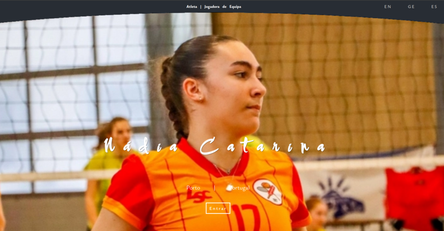

# Profile-Nadia-v1
First training project in WEB Development, at the Digital Career Institute - DCI

- My first presentation project in the course of WEB Development Digital Career Institute - DCI.
- Main objective to express my current knowledge after two months of continuous training, as well as my work style and solutions with which I feel comfortable.
- This Portfolio consists of...
- - A landing page
- - A main home page
- - An About Page
- - a menu for two pages
- - - Specs
- - - Portfolio (images)
- The page is responsive but will be improved.

## PROGRAMMING LINGUAGES USED
- HTML
- SASS

## THINGS THAT WILL BE ADDED IN FUTURE VERSIONS
- Be full resposive
- add text content about myself
- fix some small issues.
- add the blog page, with database support
- make join email list fully working
- add JS content based on future learning to start soon

